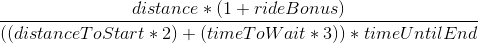

# Solution to the 2018 Google Hash Code online qualification round (Javascript)

#### https://hashcode.withgoogle.com

## Problem Statement

#### [PDF](./other/online_qualification_round_2018.pdf)

## Algorithm

#### While there are unassigned rides, our algorithm takes a vehicle that has below the average steps (distance travelled) and assigns it the best possible ride for that vehicle, using this formula (you can try coming up with a better one):
 

## Usage

#### 0 dependencies. All you need is node.js installed.

```
node index.js (a | b | c | d | e)
```

#### We also built an engine that allows you to get immediate feedback in the console on how well you have done. It calculates the score for you and eliminates the need to submit your solution each time.

## Score

| Input                                             | Points                                   |
| ------------------------------------------------- | ---------------------------------------: |
| [A - example](./input/a_example.in)               | [10](./output/a_example.out)             |
| [B - should be easy](./input/b_should_be_easy.in) | [176,877](./output/b_should_be_easy.out) |
| [C - no hurry](./input/c_no_hurry.in)             | [15,803,878](./output/c_no_hurry.out)    |
| [D - metropolis](./input/d_metropolis.in)         | [10,677,057](./output/d_metropolis.out)  |
| [E - high bonus](./input/e_high_bonus.in)         | [21,461,975](./output/e_high_bonus.out)  |
       Total score: 48,119,797 (402/2386 in the extended round)

## Authors:

#### Georgi Georgiev [@ggeorgiev](https://github.com/ggeorgievx)

#### Lazar Malezanov [@lazar-malezanov](https://github.com/lazar-malezanov)
